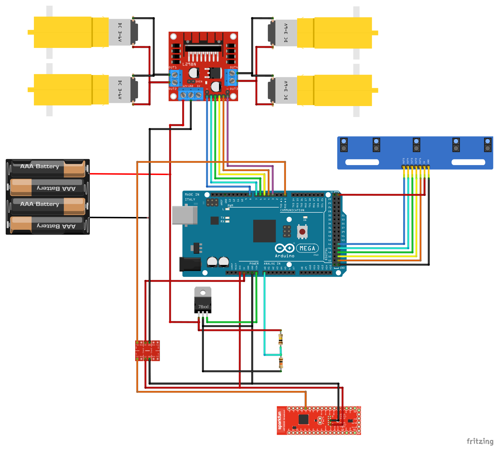

# PID-Line-Follower

BLE-based wireless PID line-following robot using Arduino + nRF5340.

Sends PID tuning parameters over BLE from a Python desktop app and controls
motor speed based on 5-channel IR sensor input with battery voltage compensation.

## Structure
- `PID-Line-Follower.ino` — Arduino sketch (sensors, PID, BLE reception, motor control)
- `Scanner.py` — Python desktop app (tkinter + bleak) for wireless PID tuning over BLE
- `firmware/` — nRF5340 Zephyr BLE-to-UART bridge firmware (Nordic UART Service)
- `assets/schematic.png` — Circuit schematic

## Hardware
- Arduino Mega
- 5× IR sensors for line detection
- L298N motor driver
- nRF5340 DK (acts as BLE-to-UART bridge between PC and Arduino)
- Voltage divider for battery monitoring

## Controls
PID gains (Kp, Ki, Kd) and max speed are adjustable wirelessly
via BLE using `Scanner.py`.

## Quick Start
1. Flash `firmware/` to an nRF5340 DK using Zephyr / nRF Connect SDK
2. Upload `PID-Line-Follower.ino` to Arduino Mega
3. Connect nRF5340 DK UART to Arduino Serial (115200 baud)
4. Run `python Scanner.py` and connect to the nRF5340 DK via BLE
5. Send `p<value>`, `i<value>`, `d<value>`, `v<value>` to tune PID

